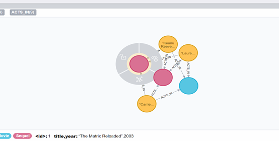

初始建立数据库，使用neo4j-import工具，可支持并行，可扩展的大规模CSV文件数据导入。

#使用neo4j-import须注意的地方：
（1）数据库不存在（删除数据库命令：命令行cd至databases后执行 rm -rf graph.db(系统默认数据库))
（2）在bin目录下创建一个importdata的文件夹存放CSV文件
（3）在此目录下执行"neo4j-import --into [PATH] --nodes [nodeA.csv] --nodes [nodeB.csv] --relationships [C.csv]",其中 [PATH] 为新建的neo4j数据库所在目录，[nodeA.csv]和[nodeB.csv]是实体节点文件，[C.csv]是边关系文件。
实测可用："neo4j-admin import --mode=csv --database=userMovie.db(新数据库的名字) --nodes importdata\movies.csv --nodes importdata\actors.csv --relationships importdata\roles.csv"
（4）建立后查看新建的数据库：
neo4j默认的数据库是data/databases下面的graph.db，浏览器也会默认的访问这个graph数据库，所以当你新建了一个数据库的时候，就需要去修改配置文件。
打开conf文件夹下的目录下的neo4j.conf文件，将文件中dbms.active_database = graph.db 修改为 dbms.active_database = 新建的数据库名称.db，一定要将将前面的#号删除掉！！！有#号表示并不执行，是默认设置graph.da，修改之后保存再启动数据库即可。

建议将neo4j安装成服务：
bin\neo4j install-service(安装)
bin\neo4j uninstall-service(卸载)
每次启动时在命令行中执行neo4j start然后在浏览器中打开就好了！！
用完可以执行neo4j stop停止服务！

所需的基本CSV文件由两部分组成，一个为构建节点用的CSV，一个为把节点联系起来的关系CSV。
实例如下所示：
建立演员个体节点：

| :ID（也可不为数字,理解为主码） | name(也可包含age等属性) | :LABEL（可以多个标签） |
| ------------------------------ | ----------------------- | ---------------------- |
| 15631                          | “Keanu Reeves”          | Actor                  |
| 15632                          | “Laurence Fishburne”    | Actor                  |
| 15633                          | “Carrie-Anne Moss”      | Actor                  |

 

建立电影个体：
| :ID   | title,year                    | :LABEL       |
| ----- | ----------------------------- | ------------ |
| 15634 | “The Matrix”,1999             | Movie        |
| 15635 | “The Matrix Reloaded”,2003    | Movie;Sequel |
| 15636 | “The Matrix Revolutions”,2003 | Movie;Sequel |

 

为电影与演员创建关系：

| :START_ID | Role(可理解为关系的属性) | :END_ID | :TYPE(可理解为关系名) |
| --------- | ------------------------ | ------- | --------------------- |
| 15631     | “Neo”                    | 15634   | ACTS_IN               |
| 15631     | “Neo”                    | 15635   | ACTS_IN               |
| 15631     | “Neo”                    | 15636   | ACTS_IN               |
| 15632     | “Morpheus”               | 15634   | ACTS_IN               |
| 15632     | “Morpheus”               | 15635   | ACTS_IN               |
| 15632     | “Morpheus”               | 15636   | ACTS_IN               |
| 15633     | “Trinity”                | 15634   | ACTS_IN               |
| 15633     | “Trinity”                | 15635   | ACTS_IN               |
| 15633     | “Trinity”                | 15636   | ACTS_IN               |
 

导入数据库后知识图谱示例：

提供一种可实时跟新并检查节点和关系是否已存在数据库的方式：merge
1.找不到标签则创建：
MERGE (type:nodename)
RETURN type, labels(type)

2.找不到属性则创建:
MERGE (charlie { name: 'Charlie Sheen', age: 10 })
RETURN charlie

3.找不到标签和属性则创建:
MERGE (michael:Person { name: 'Michael Douglas' })
RETURN michael.name, michael.bornIn

4.根据已有的节点属性创建:
MATCH (person:Person)
MERGE (city:City { name: person.bornIn })
RETURN person.name, person.bornIn, city

5.在创建的时候使用on create(在创建时进行一些操作):
MERGE (keanu:Person { name: 'Keanu Reeves' })
ON CREATE SET keanu.created = timestamp()
RETURN keanu.name, keanu.created

6.在创建的时候使用 on match:
MERGE (person:Person)
ON MATCH SET person.found = TRUE RETURN person.name, person.found

7.同时使用on create 和 on match:
MERGE (keanu:Person { name: 'Keanu Reeves' })
ON CREATE SET keanu.created = timestamp()
ON MATCH SET keanu.lastSeen = timestamp()
RETURN keanu.name, keanu.created, keanu.lastSeen

参考文献:
https://neo4j.com/docs/developer-manual/3.4/cypher/clauses/merge/

即将更新在Windows下的数据库备份与恢复，考虑使用neo4j-admin来做（敬请期待）！